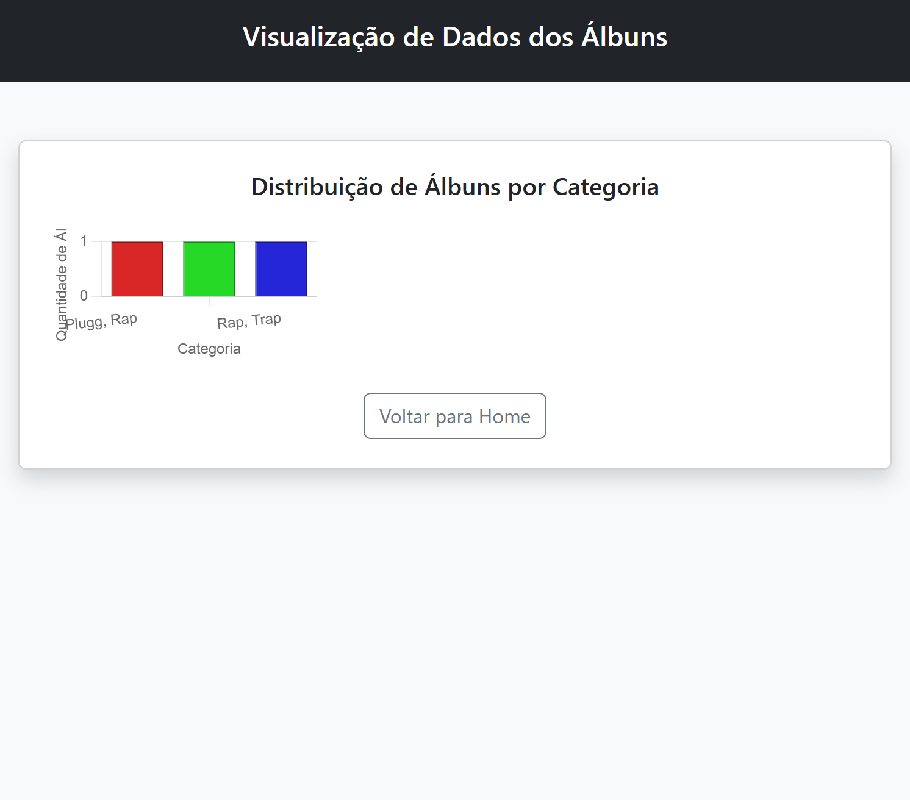

# Trabalho Prático 07 - Semanas 13 e 14

A partir dos dados cadastrados na etapa anterior, vamos trabalhar formas de apresentação que representem de forma clara e interativa as informações do seu projeto. Você poderá usar gráficos (barra, linha, pizza), mapas, calendários ou outras formas de visualização. Seu desafio é entregar uma página Web que organize, processe e exiba os dados de forma compreensível e esteticamente agradável.

Com base nos tipos de projetos escohidos, você deve propor **visualizações que estimulem a interpretação, agrupamento e exibição criativa dos dados**, trabalhando tanto a lógica quanto o design da aplicação.

Sugerimos o uso das seguintes ferramentas acessíveis: [FullCalendar](https://fullcalendar.io/), [Chart.js](https://www.chartjs.org/), [Mapbox](https://docs.mapbox.com/api/), para citar algumas.

## Informações do trabalho

- Nome: Lucas Damacena de Souza
- Matricula: 901048
- Proposta de projeto escolhida: Música Indie Brasileira
- Breve descrição sobre seu projeto: O projeto apresenta uma galeria dinâmica de álbuns de música indie brasileira, com informações sobre artistas, estilos e datas de lançamento.

**Print da tela com a implementação**

Nesta etapa, foi criada uma nova página para exibir os dados dos álbuns de forma dinâmica usando a biblioteca Chart.js. A página faz uma leitura dos dados cadastrados no JSON Server, organiza as categorias dos álbuns e gera automaticamente um gráfico de barras que mostra a quantidade de álbuns por categoria. Assim, sempre que os dados são alterados no CRUD, o gráfico é atualizado e reflete as mudanças. Os prints mostram dois exemplos diferentes dessa visualização funcionando.

